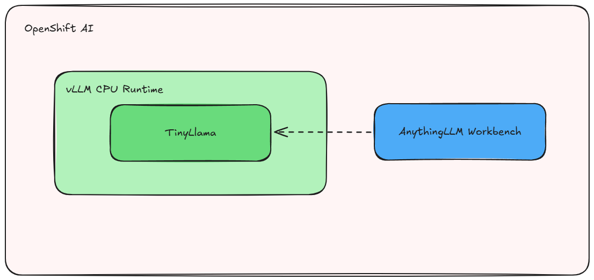
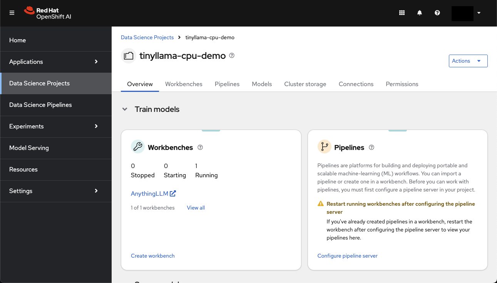
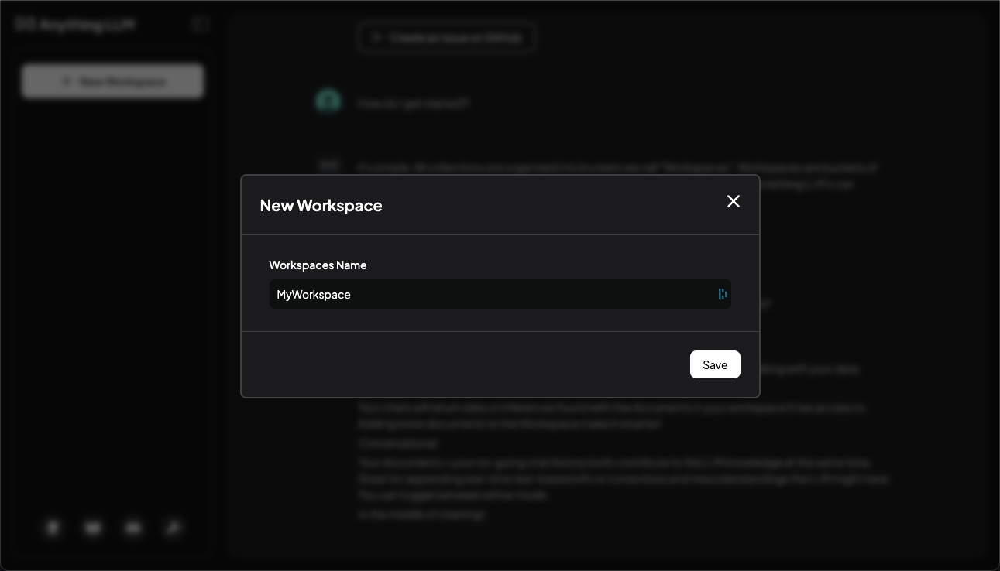

# vllm-cpu

Welcome to the vLLM CPU quickstart!
Use this to quickly get a vLLM up and running in your environment.  
To see how it's done, jump straight to [installation](#install).

## Detailed description 

The vLLM CPU quickstart is a quick-start template for deploying vLLM on CPU-based infrastructure within Red Hat OpenShift. It’s designed for environments where GPUs are not available or necessary, making it ideal for lightweight inference use cases, prototyping, or constrained environments.  
In this Quickstart, we are utilizing it to easily get an LLM deployed in most environments.

This quickstart includes a Helm chart for deploying:

- An OpenShift AI Project.
- vLLM with CPU support running an instance of TinyLlama.
- AnythingLLM (a versitile chat interface) running as a workbench and connected to the vLLM.

Use this project to quickly spin up a minimal vLLM instance and start serving models like TinyLlama on CPU—no GPU required. 🚀

### See it in action

Red Hat uses Arcade software to create interactive demos. Check out 
[Quickstart with TinyLlama on CPU](https://interact.redhat.com/share/zsT3j9cgPt9yyPchb7EJ)
 to see it in action.


### Architecture diagrams



### References 

- The runtime is built from [vLLM CPU](https://docs.vllm.ai/en/latest/getting_started/installation/cpu.html)
- Runtime image is pushed to [quay.io/repository/rh-aiservices-bu/vllm-cpu-openai-ubi9](https://quay.io/repository/rh-aiservices-bu/vllm-cpu-openai-ubi9)
- Code for Runtime image and deployment can be found on [github.com/rh-aiservices-bu/llm-on-openshift](https://github.com/rh-aiservices-bu/llm-on-openshift/tree/main/serving-runtimes/vllm_runtime)

## Requirements 

### Recommended hardware requirements 

- No GPU needed! 🤖
- 8 cores 
- 8 Gi 
- Storage: 5Gi

Note: This version is compiled for Intel CPU's (preferrably with AWX512 enabled to be able to run compressed models as well, but optional).  
Here's an example machine from AWS that works well: [https://instances.vantage.sh/aws/ec2/m6i.4xlarge](https://instances.vantage.sh/aws/ec2/m6i.4xlarge)

### Minimum hardware requirements 

- No GPU needed! 🤖
- 2 cores 
- 4 Gi 
- Storage: 5Gi 

### Required software  

- Red Hat OpenShift 
- Red Hat OpenShift AI 
- Dependencies for [Single-model server](https://docs.redhat.com/en/documentation/red_hat_openshift_ai_self-managed/2.16/html/installing_and_uninstalling_openshift_ai_self-managed/installing-the-single-model-serving-platform_component-install#configuring-automated-installation-of-kserve_component-install):
    - Red Hat OpenShift Service Mesh
    - Red Hat OpenShift Serverless

### Required permissions

- Standard user. No elevated cluster permissions required 

## Install

**Please note before you start**

This example was tested on Red Hat OpenShift 4.16.24 & Red Hat OpenShift AI v2.16.2.  

### Clone

```
git clone https://github.com/rh-ai-quickstart/llm-cpu-serving.git && \
    cd vllm-cpu/  
```


### Create the project

```bash
PROJECT="tinyllama-cpu-demo"

oc new-project ${PROJECT}
``` 

### Install with Helm

```
helm install vllm-cpu helm/ \
    --namespace  ${PROJECT} 
```

### Wait for pods

```
oc -n ${PROJECT}  get pods -w
```

```
(Output)
NAME                                         READY   STATUS    RESTARTS   AGE
anythingllm-0                                2/2     Running   0          5m
tinyllama-1b-cpu-predictor-df76b56d6-fw8fp   2/2     Running   0          5m
```

### Test

You can get the OpenShift AI Dashboard URL by:
```bash
oc get routes rhods-dashboard -n redhat-ods-applications
```

Once inside the dashboard, navigate to Data Science Projects -> tinyllama-cpu-demo (or what you called your ${PROJECT} if you changed from default).


Inside the project you can see Workbenches, open up the one for AnythingLLM.


Finally, you can create a new Workspace in AnythingLLM and start chatting with your model! :)



## Uninstall
```
helm uninstall vllm-cpu --namespace ${PROJECT} 
```
